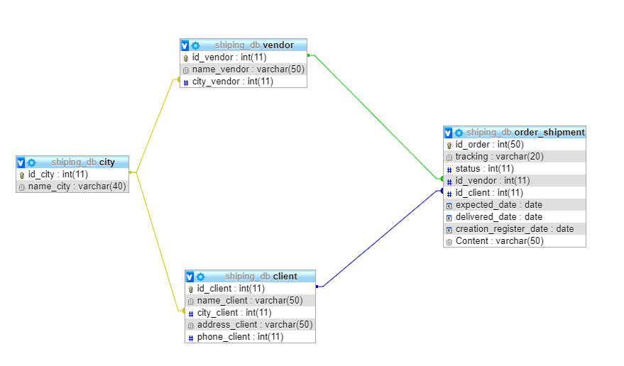

# Shiping - web app

* **category**    Web information system 📡
* **author**      Juan Diego Alfonso <jalfons.ocampo@gmail.com>
* **copyright**   none
* **source**      https://github.com/halcolo/Shiping_app/ 

# Description

This app work as administrator of shipment, the application calculate based in the past data, the time of each shipment depend each vendor, when you create an order, depend the city this app calculate a different time and show you what is the status of the actual shipment than has not delivered yet, the app show the next status depends the time calculed.

The red truck is shown if the order pass the delivery expected time.

The yellow truck is a deadline alert (3 days before expected time).

And the green truck means the delivery it goes according to plan.

# USE
If you want start use this aplication you need create the database shiping_db and import the archive `shiping_db_seed.sql` located in [the seed](https://github.com/halcolo/Shiping_app/tree/master/seed) directory.
The Database credentials can be change in the archive `connection.php` located in the [model](https://github.com/halcolo/Shiping_app/tree/master/model) directory , the work enviroment is:
 | Aplication| Version|
| ------ | ------ |
| PHP| `PHP v 5.7.19` |
| MySql| `MySql v 5.7.19` |
| Apache | `Apache 2.4.27` |
| PhpMyAdmin | `PhpMyAdmin v 4.7.4`  |

And the database have the next estructure:

":relation:")
